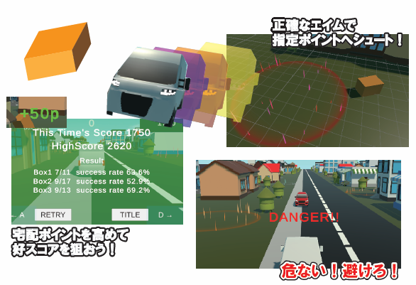
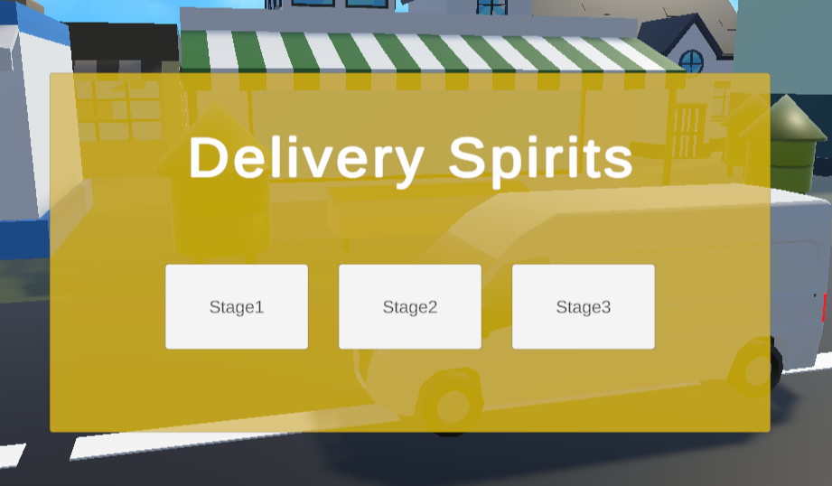

# Delivery Spirits


自動で前に進むトラックから指定された場所にマウスと荷物を投げることができる。

***

## ゲーム企画




***
使ってる技術　unity


***
## 作品のPOINT
### シネマサンシャインの活用



シネマサンシャインコンポーネントを使って、タイトル時やステージクリア時ダイナミックなカメラワークに切り替わるようにしています。

### スカイボックスやライティングの調整

ステージごとにスカイボックスやライティングの調整行って雰囲気をがらっとかえてます


###　３つの宅配物と3つのゴール 

エフェクトをつかったゴールのエリアを用意。
宅配物を投函する単純すぎておもしろさがないためたのしめるように工夫しています。

シュータ.csの抜粋
```C#
public GameObject[] boxPrefabs; //宅配物のプレハブを格納
//生成対象のBoxの切り替え
if (Input.GetMouseButtonDown(1))
{
    boxNum++;
    if (boxPrefabs.Length == boxNum) boxNum = 0;
}

```
ぽすと.csの抜粋
```C#
private void OnTriggerEnter(Collider other)
{
    if (!posted)
    {
        switch (type)
        {
            case PostType.box1:
                if (other.gameObject.CompareTag("Box1"))
                    //宅配完了の処理
                    PostComp();
                    break;
            case PostType.box2:
                if (other.gameObject.CompareTag("Box2"))
                    //宅配完了の処理
                    PostComp();
                    break;
            case PostType.box3:
                if (other.gameObject.CompareTag("Box3"))
                    //宅配完了の処理
                    PostComp();
                    break;
        }                        
    }
}

```
### 宅配成功率の計算

荷物を投函する際に、ゴールに投函が成功した際にそれぞれ色のにカウントしてゲームのクリア時の
成功率をだすことによってシンプルながらたのしめるように工夫しました。

```C#
//ハイスコアの更新
                if (GameController.stagePoints > highScore)
                {
                    highScore = GameController.stagePoints;
                    PlayerPrefs.SetInt(currentStageName, highScore);                    
;               }
//各スコアの表示
                thisTimesScoreText.text = "This Time's Score " + currentPoint.ToString(); //ハイスコアの表示

                highScoreText.text = "HighScore " + highScore; //ハイスコアの表示
                //3つのBoxの成功率を表示
                for(int i =0; i < resultNames.Length; i++)
                {
                    float successRate;
                    if (Shooter.shootCounts[i] == 0) successRate = 0;
                    else
                    {
                        //Boxの計算 ※少なくとも片方はfloatにキャスト
                        successRate = ((float)Post.successCounts[i] / Shooter.shootCounts[i]) * 100f;
                    }
                    boxText[i].text = resultNames[i] + " " + Post.successCounts[i] + "/" + Shooter.shootCounts[i] + "  success rate " + successRate.ToString("F1") + "%";
                }
                GameController.gameState = GameState.timeover;
                //リザルトパネルの表示
                resultPanel.SetActive(true);
                //カーソルロックモードの解除
                Cursor.lockState = CursorLockMode.None;
                Cursor.visible = true
```
など沢山工夫を凝らしています。

### 今後の制作
*
*
*
など予定しまいます。